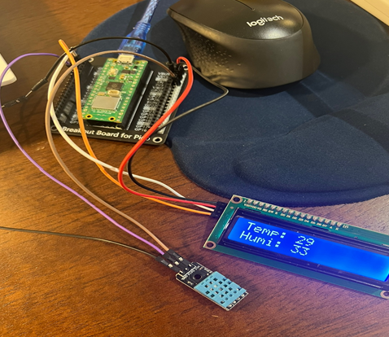
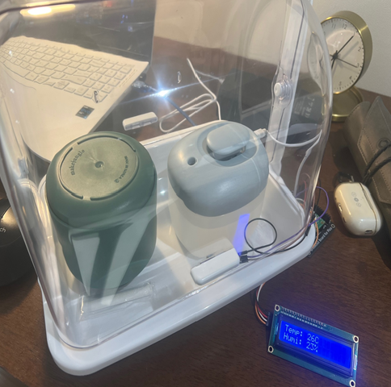
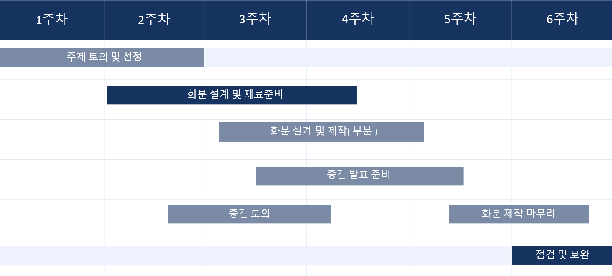
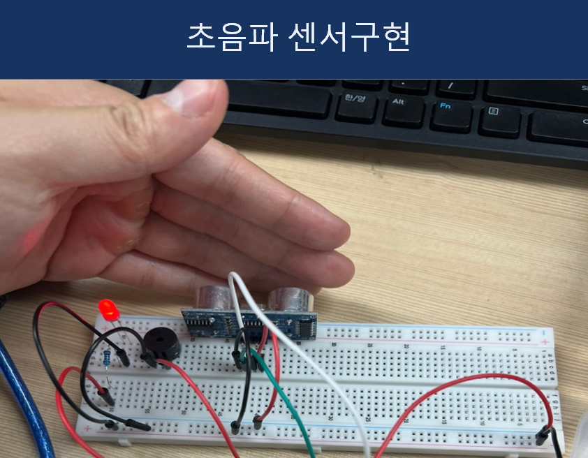
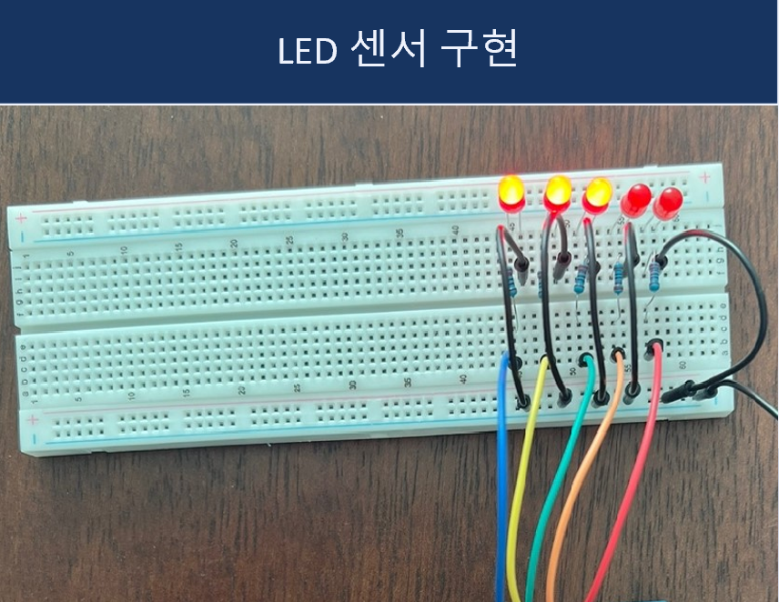
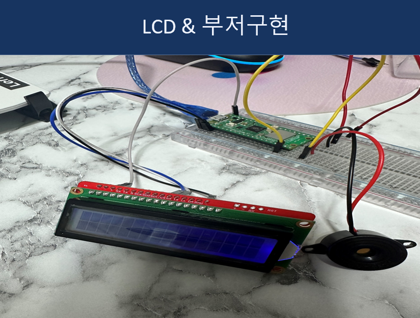
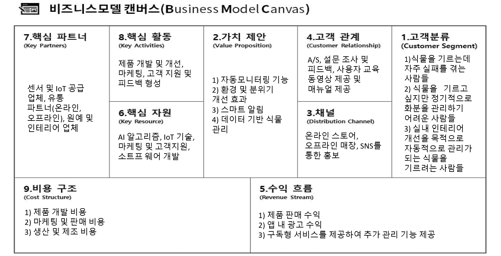

# 🌱 Smart AI Monitoring Plant
이 프로젝트는 **스마트 AI 기반 식물 모니터링 시스템**으로, 온도, 습도, 조도 등을 측정하여 식물 재배 환경을 자동으로 조절하는 스마트 화분을 구현했습니다.

## 📌 프로젝트 개요
- **기간**: 2024.09.01 ~ 2024.11.09  
- **예산**: 2만 원  
- **기술 스택**: 라즈베리파이 피코 W, Python, 센서 데이터 분석  

## 🛠 주요 기능
✅ **온도 및 습도 모니터링**  
✅ **조도 감지 및 조절**  
✅ **데이터 시각화 (LCD 디스플레이 지원)**  
✅ **AI 기반 스마트 알림 시스템**  

  
  

## 👨‍💻 팀원
| 이름  | 학과  | 학번  | 역할  |
|--------|--------|--------|--------|
| **이승윤**(팀장) | 첨단기계공학 | 22011564 | 화분 설계 및 센서 구현 |
| **남태우** | 산업공학 | 22430082 | 화분 제작 설계 및 비즈니스 모델 설계 |
| **박상현** | 첨단기계공학 | 22011790 | 화분 센서 구현 및 스마트 기술 설계 |
| **이송지** | 정보통신공학 | 22212139 | 센서 동작 알고리즘 구현 |
| **최혜정** | 컴퓨터공학 | 22112339 | 화분 동작 센서 구현 |

## 📅 프로젝트 일정

  

## 🔧 **센서 및 하드웨어 구현**
### 🔹 **초음파 센서 구현**

  

### 🔹 **LED 센서 구현**

  

### 🔹 **LCD & 부저 구현**

  

## 💼 **비즈니스 모델**
- 고객 타겟: 식물을 키우는 데 어려움을 겪는 사람들  
- 핵심 가치: 자동화된 환경 관리, AI 기반 스마트 알림

  

